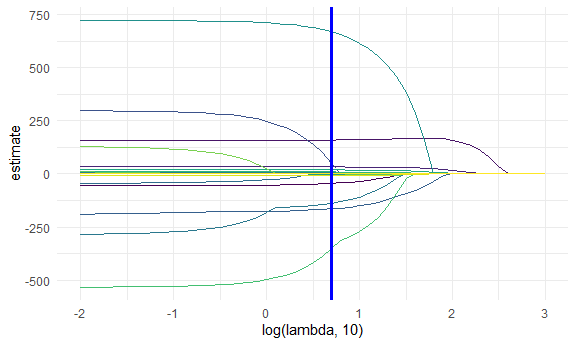
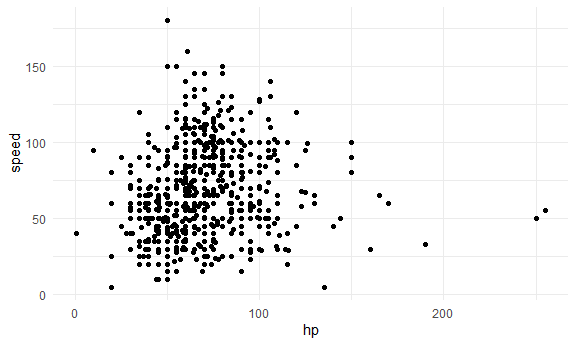
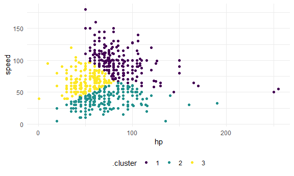
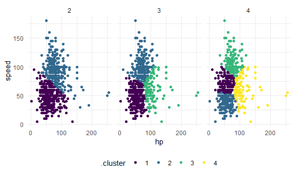

stat_learning
================
Jiayi Shi
2022-12-01

## Lasso

``` r
bwt_df = 
  read_csv("./data/birthweight.csv") %>% 
  janitor::clean_names() %>%
  mutate(
    babysex = as.factor(babysex),
    babysex = fct_recode(babysex, "male" = "1", "female" = "2"),
    frace = as.factor(frace),
    frace = fct_recode(frace, "white" = "1", "black" = "2", "asian" = "3", 
                       "puerto rican" = "4", "other" = "8"),
    malform = as.logical(malform),
    mrace = as.factor(mrace),
    mrace = fct_recode(mrace, "white" = "1", "black" = "2", "asian" = "3", 
                       "puerto rican" = "4")) %>% 
  sample_n(200)
```

    ## Rows: 4342 Columns: 20
    ## ── Column specification ────────────────────────────────────────────────────────
    ## Delimiter: ","
    ## dbl (20): babysex, bhead, blength, bwt, delwt, fincome, frace, gaweeks, malf...
    ## 
    ## ℹ Use `spec()` to retrieve the full column specification for this data.
    ## ℹ Specify the column types or set `show_col_types = FALSE` to quiet this message.

To create a predictor matrix `x` that includes relevant dummy variables
based on factors, we’re using `model.matrix()` and excluding the
intercept \[,-1\]

``` r
x = model.matrix(bwt ~ ., bwt_df)[,-1] # matrix of all predictors
y = bwt_df$bwt # response variable
```

``` r
set.seed(1)

lambda = 10^(seq(3, -2, -0.1))

lasso_fit =
  glmnet(x, y, lambda = lambda)
# no need for cv, fit = glmnet(x, y) will take care of best lambda for you.

lasso_cv =
  cv.glmnet(x, y, lambda = lambda) # cross validation to find the best lambda

lambda_opt = lasso_cv$lambda.min
```

``` r
broom::tidy(lasso_fit) %>% 
  select(term, lambda, estimate) %>% 
  complete(term, lambda, fill = list(estimate = 0) ) %>% 
  filter(term != "(Intercept)") %>% 
  ggplot(aes(x = log(lambda, 10), y = estimate, group = term, color = term)) + 
  geom_path() + 
  geom_vline(xintercept = log(lambda_opt, 10), color = "blue", size = 1.2) +
  theme(legend.position = "none")
```



## Clustering: Pokemon

``` r
poke_df = 
  read_csv("./data/pokemon.csv") %>% 
  janitor::clean_names() %>% 
  select(hp, speed)
```

    ## Rows: 800 Columns: 13
    ## ── Column specification ────────────────────────────────────────────────────────
    ## Delimiter: ","
    ## chr (3): Name, Type 1, Type 2
    ## dbl (9): #, Total, HP, Attack, Defense, Sp. Atk, Sp. Def, Speed, Generation
    ## lgl (1): Legendary
    ## 
    ## ℹ Use `spec()` to retrieve the full column specification for this data.
    ## ℹ Specify the column types or set `show_col_types = FALSE` to quiet this message.

``` r
poke_df %>% 
  ggplot(aes(x = hp, y = speed)) + 
  geom_point()
```



K-means clustering is established enough that it’s implemented in the
base R stats package in the `kmeans` function. `broom::augment` to add
cluster assignments to the data.

``` r
kmeans_fit =
  kmeans(x = poke_df, centers = 3)

poke_df =
  broom::augment(kmeans_fit, poke_df)

poke_df %>% 
  ggplot(aes(x = hp, y = speed, color = .cluster)) +
  geom_point()
```



Find best k.

``` r
clusts =
  tibble(k = 2:4) %>%
  mutate(
    km_fit =    map(k, ~kmeans(poke_df, .x)),
    augmented = map(km_fit, ~broom::augment(.x, poke_df))
  )

clusts %>% 
  select(-km_fit) %>% 
  unnest(augmented) %>% 
  ggplot(aes(hp, speed, color = .cluster)) +
  geom_point(aes(color = .cluster)) +
  facet_grid(~k)
```



## Clustering: trajectories
